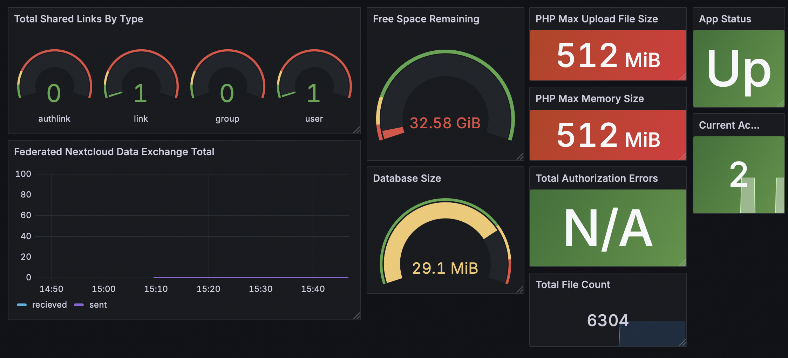
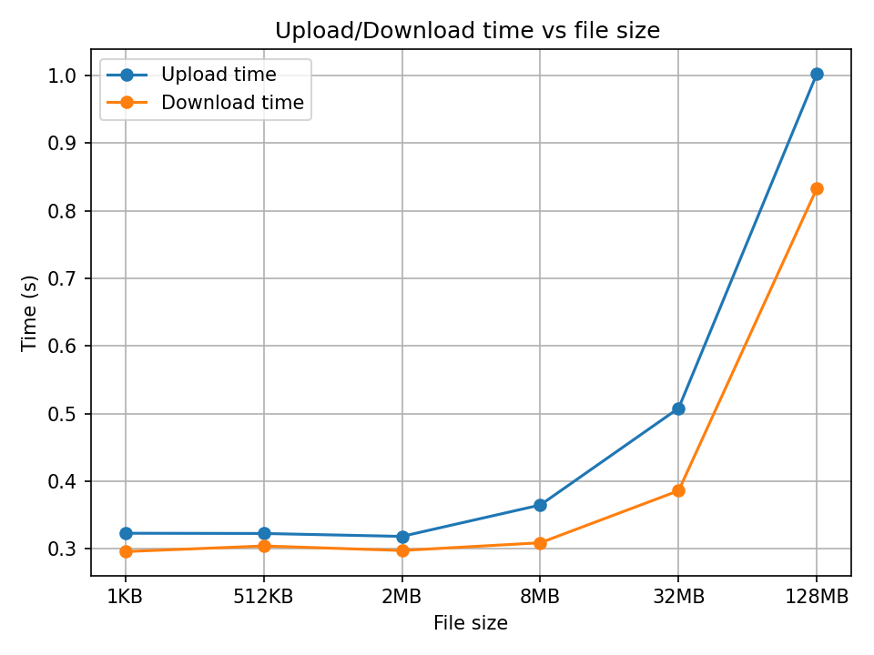

# Cloud-Based File Storage System

## Deployment
We deploy the system with Docker and Docker Compose. Using Compose, we define the multi-container stack and connect Locust, Grafana, and Prometheus to Nextcloud. By editing `docker-compose.yml`, you can swap the database backend and modify Nextcloud settings.

To run the docker containers just go to the directory that contains the `docker-compose.yml` file and run the following command:
```
docker-compose up -d
```

## Monitoring with Grafana
To monitor performance, we run three extra containers: Grafana (a visualization tool), Prometheus (which acts as Grafana’s data source), and Nextcloud Exporter (which works as a bridge between Nextcloud and Prometheus).
After bringing them up with Docker Compose, open Grafana at `http://localhost:3000`, log in, and add a Prometheus data source. Set the Prometheus server to `http://localhost:9090` and make sure everything is up.Once the data source is saved and healthy, create your dashboard in the Grafana UI or import an existing `.json` dashboard file.

I found a pretty nice dashboard on the Grafana official web site and I decided to import that one. When the dashboard is connected you can see various metrics, this is how the one I imported looks:




## Perfomance Evaluation

To assess the performance of the file storage system, we created files of different sizes using the `dd` command. We then uploaded these files to, and downloaded them from, the system while measuring the time to complete each operation. The script used for these tests is provided in `upload\_and\_download.sh`.

The following plots report the elapsed time for download and upload as a function of the file size. 





